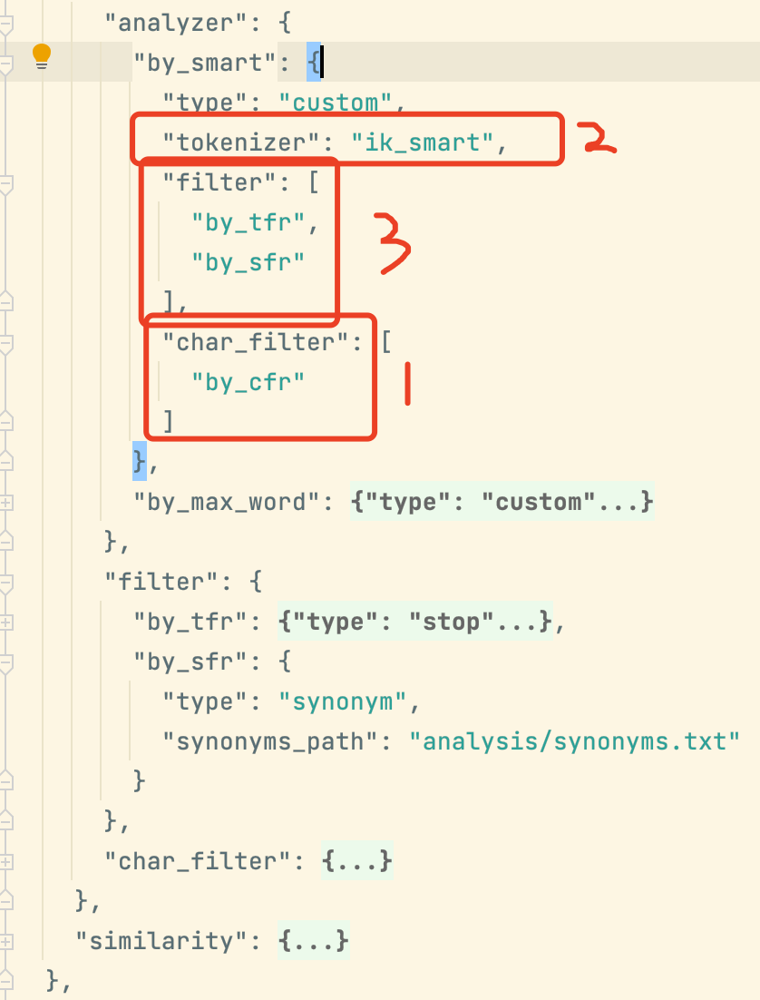

# 详解了ik源码思路和代码的对应关系
// 附录1
3.1 词典构造
3.2 分词
3.3 消除歧义: 也就是说，在第三步这边，ik_smart会对结果比ik_max_word多一个筛选的过程。
3.4 输出结果: 该部分的主要逻辑，就是对于那些没有被分词分到的位置，用单字输出的方式输出词元。

## tokenizer、analyzer
附录1.1


# 同义词
// 附录1.1.1
analyzer = [char_filter] + tokenizer + [token filter]

分词过程中: 同义词在analyzer的[token filter]阶段 进行，
同义词初始化和配置文件读取在es-6.5.0`org.elasticsearch.index.analysis.SynonymTokenFilterFactory.getRulesFromSettings`
注意本质是读取的es索引mapping配置的同义词路径.

## esv6.5.0 - 同义词的初始化，读取配置的地方
idea书签
```shell script
org.elasticsearch.index.analysis.SynonymTokenFilterFactory.getRulesFromSettings
```

一个典型的包含同义词的自定义分词配置


### TODO 同义词的相对路径是相对哪里?
```shell script
x
```

## 该ik项目想要用同义词,应该把同义词文件放在哪里?
A: ik没有实现同义词，那是es的[token filter]的功能，ik插件只是单独的[tokenizer]部分
应该不行。需要在es源码中配置同义词。// 参考:[Elasticsearch 使用IK分词，如何配置同义词？](https://elasticsearch.cn/?/question/29)


# 修改mian.dic观察词典初始化过程

# 附录
1.[IK分词器源码阅读笔记](https://www.aramigo.ltd/index.php/archives/88/)
1.0 [IK分词器原理--写死Dictionary中词典配置文件目录](https://juejin.cn/post/6845166891120476168)
    1.0.0 [IK分词器 原理分析 源码解析 -- 分步骤和函数的解析](https://www.cnblogs.com/jpfss/p/11413473.html)

1.1 AnalysisIkPlugin.java中的tokenizer、analyzer 
[es中的analyzer，tokenizer，filter你真的了解吗？](https://cloud.tencent.com/developer/article/1851823?from=article.detail.1706529)
[Elasticsearch Analyzer 的内部机制](https://mednoter.com/all-about-analyzer-part-one.html)

1.1.1 同义词 [理解Elasticsearch分析器 analyzer](https://juejin.cn/post/6939396159983222815)